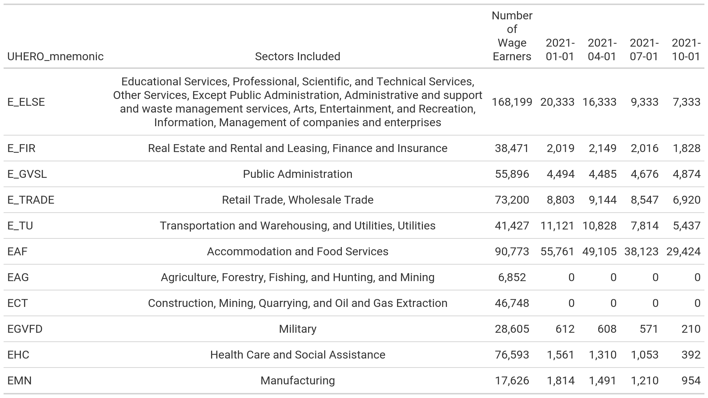
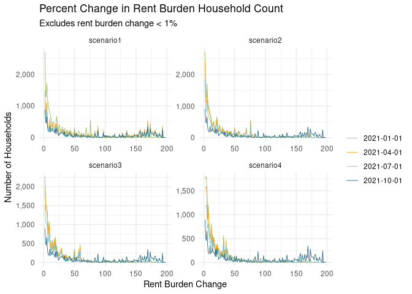
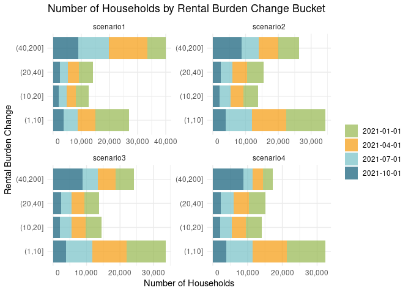
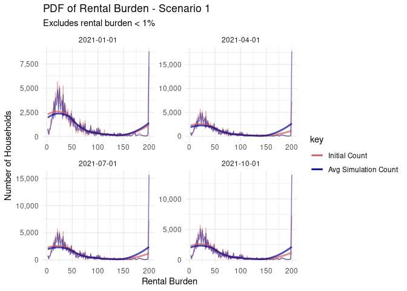

Covid-19 Hawai’i Rental Assistance - 2021 Update
================
Isabelle Picciotto

The following analysis of the burden renters will face in HI in 2021 is
presented in [this UHERO blog post](https://uhero.hawaii.edu/?p=9924).

``` r
# Install required packages

# pkgs <- c(
#   "rmarkdown",
#   "tidyverse",
#   "lubridate",
#   "scales",
#   "svMIsc",
#   "gt",
#   "furrr",
#   "webshot"
# )
# 
# install.packages(pkgs)
```

``` r
library(rmarkdown)
library(tidyverse)
library(lubridate)
library(scales)
library(svMisc)
library(gt)
library(furrr)
library(webshot)

options(scipen = 999)

plan(multiprocess)

furrr_options(seed = TRUE)
```

    ## <furrr_options>

``` r
chart_cols<-c("2021-01-01" = "#9BBB59", "2021-04-01" = "#F6A01B", "2021-07-01" = "#7EC4CA", "2021-10-01" = "#1D667F")
```

### Data Sources

Individual level income and jobs data is sourced from the American
Community Survey (ACS) 2018 IPUMS microdata. Household survey weights
are utilized to scale the 4,800 surveyed households to the 455,000 total
households in the state.

Industry-level job losses for 2021 are forecasted by UHERO. Forecasted
losses are randomly assigned to individuals by industry. We assume that
65% of job losses will be assigned to individuals who are below the
median income of each industry.

### Number of Iterations

``` r
n_iterations <- 100
```

In order to avoid aberrations based on a single random draw, the
analysis is repeated 100 times and the results are averaged over all
simulations.

### UHERO Job Loss Forecasts

``` r
# Load UHERO job forecast file
uhero_forecast<-read_csv("data/uhero_jobs_forecast.csv")

### Clean up job columns:
  # List of UHERO job mnemonics to retain in the forecast file
job_mnemonics<-c("E@HI", "E_NF@HI", "EGV@HI", "EGVFD@HI", "E_GVSL@HI", "ECT@HI", "EMN@HI", "E_TRADE@HI", "E_TU@HI",
                 "E_FIR@HI", "E_SV@HI", "EHC@HI", "EAF@HI", "E_ELSE@HI")

uhero_jobs<-uhero_forecast %>%
  select(Date, starts_with(job_mnemonics)) %>%
  select(Date, ends_with("(new)"))

# Rename columns
new_colnames<-str_remove_all(string = colnames(uhero_jobs), pattern = "@HI \\(new\\)*")
colnames(uhero_jobs)<-new_colnames

# Create the agricultural job series
uhero_jobs<-uhero_jobs %>%
  mutate(EAG = E - E_NF)

# Calculate job losses since the pandemic for 2021 Q1 - Q4 (Use pre-pandemic jobs at 2019 Q4)
uhero_jobs_slice<-filter(uhero_jobs, between(Date, as.Date("2019-10-01"), as.Date("2021-10-01"))) %>%
  mutate_at(.vars = vars(-Date), function(x) (x - first(x))*1000) %>%
  mutate_at(.vars = vars(-Date), function(x) if_else(x < 0, abs(x), 0)) %>%
  # Keep only 2021
  filter(Date > as.Date("2020-10-01"))
```

### ACS (2018) IPUMS Microdata Cleaning

``` r
# Read IPUMS csv file
ipums_raw<-read_csv("data/ACS_2017-2018.csv")

### Filter the IPUMS data 
  # Restrict the sample only to Year == 2018
  # Remove all OWNERSHP = 0 because these are NA (not rental or owned)
  # Exclude NA coded values in the INCTOT and INCWAGE columns
ipums_2018<-filter(ipums_raw, YEAR == 2018 & OWNERSHP != 0) %>%
  mutate(inc_total = INCTOT %>% na_if(9999999),
         inc_wage = INCWAGE %>% na_if(999999) %>% na_if(999998),
         hh_income = HHINCOME %>% na_if(9999999),
         rent_grs = if_else(OWNERSHP == 2, RENTGRS, NA_real_),
         rent_burden = if_else(rent_grs == 0, 0, pmin(rent_grs/(hh_income/12)*100, 200))) %>%
  mutate(inc_total = if_else(inc_total < inc_wage, inc_wage, inc_total))

### Apply household weightings to the data
  # Duplicate households based on household weight (HHWT)
  # Create a new unique HH identifier for the duplicated households
ipums_weighted<-ipums_2018 %>%
  group_by(SERIAL) %>%
  uncount(weights = HHWT, .id = "ID") %>%
  unite("hhid", c("SERIAL", "ID"), sep = "_", remove = F) %>%
  ungroup() %>%
  group_by(hhid)
```

### Data Cleaning and Joining

In order to assign UHERO job losses to individuals in the ACS (2018)
IPUMS Microdata, the UHERO job industry mnemonics are joined to the ACS
job categories using their Census Code. Original mapping of UHERO
mnemonic to Census Code was done using NAICS codes.

``` r
# Load the industry uhero mnemonic csv file
ind_uhero_match<-read_csv("data/industry_code_uhero_mnemonics.csv")

# Assign the uhero mnemonic to the ipums industry code
ipums_uhero<-left_join(ipums_weighted, ind_uhero_match, by = c("IND" = "2017 Census Code"))

# Create unique ID for each individual entry to sample from
job_loss_sim<-ipums_uhero %>%
  rowid_to_column(var = "unique_id") %>%
  ungroup()

# Get unique list of job categories included in the file
jobs<-unique(na.omit(job_loss_sim$UHERO_mnemonic))

uhero_job_loss_reshape<-uhero_jobs_slice %>%
  pivot_longer(-Date, names_to = "UHERO_mnemonic", values_to = "job_losses")

# Revise the number of job losses to equal the minimum of the total jobs or total job losses
n_jobs<-job_loss_sim %>%
  group_by(UHERO_mnemonic) %>%
  tally() %>%
  na.omit() %>%
  left_join(uhero_job_loss_reshape, by = "UHERO_mnemonic") %>%
  mutate(revised_losses = pmin(n, job_losses)) %>%
  select(-n, -job_losses) %>%
  mutate(ui_recieved = round(revised_losses*0.75),
         n_low = round(ui_recieved*0.65),
         n_high = round(ui_recieved*0.35))

# Add a median income column to the individual level data to determine whether each individual falls into the low/high income category
# Exclude all individuals with wage income equal to zero so they cannot be randomly assigned a job loss
job_sim_med<-job_loss_sim %>%
  group_by(UHERO_mnemonic) %>%
  mutate(income_cat = case_when(inc_total < median(inc_total) & inc_wage != 0 ~ "low",
                                inc_total >= median(inc_total) & inc_wage != 0 ~ "high",
                                is.na(UHERO_mnemonic) | inc_wage == 0 ~ "unassigned")) %>%
  ungroup()

# Create a table summarizing the UHERO forecasted job categories, number of wage earners per category, and number of forecasted job losses
job_summary_tbl<-job_sim_med %>% 
  left_join(select(n_jobs, revised_losses, Date, UHERO_mnemonic), by = "UHERO_mnemonic") %>% 
  select(Date, unique_id, hhid, inc_wage, hh_income, revised_losses, Industry_Sector, UHERO_mnemonic) %>% 
  filter(!is.na(Industry_Sector)) %>% 
  group_by(Date, UHERO_mnemonic) %>% 
  filter(inc_wage > 0) %>% 
  summarize("Sectors Included" = list(unique(Industry_Sector)), 
            "Number of Wage Earners" = n(), 
            "n_losses" = mean(revised_losses)) %>%
  pivot_wider(names_from = "Date", values_from = "n_losses") %>%
  gt() %>%
  fmt_number(columns = 3:7, decimal = 0) 

gtsave(job_summary_tbl, filename = "job_summary_tbl.png")
```

<!-- -->

``` r
# Clean up variables tables prior to running simulation
rm(ipums_raw, ipums_2018, ipums_uhero, uhero_forecast, uhero_jobs, uhero_job_losses, uhero_job_loss_reshape)
```

### Job Loss Simulation

To simulate the impact of COVID-19 job losses on Hawai’i rent deficit,
we estimate the change to each household’s rental burden and how much
additional support would be required to return them to their original
burden level.

Four different policy scenarios are analyzed, each scenario is repeated
100 times and the results are the average of all 100 simulations:

1.  UI gets extended for Q1 2021

2.  UI gets extended for Q1-Q3 2021

3.  UI gets extended for Q1-Q3 2021 + $100/month

4.  UI gets extended Q1-Q3 2021 + $300/month

<!-- end list -->

``` r
# Create scenario tables
scenario_list<-list("scenario_1" = tibble("Date" = as.Date(c("2021-01-01", "2021-04-01", "2021-07-01", "2021-10-01")), 
                                          "ui" = c(1, 0, 0, 0), "add" = c(0, 0, 0, 0)),
                    "scenario_2" = tibble("Date" = as.Date(c("2021-01-01", "2021-04-01", "2021-07-01", "2021-10-01")), 
                                          "ui" = c(1, 1, 1, 0), "add" = c(0, 0, 0, 0)),
                    "scenario_3" = tibble("Date" = as.Date(c("2021-01-01", "2021-04-01", "2021-07-01", "2021-10-01")), 
                                          "ui" = c(1, 1, 1, 0), "add" = c(100, 100, 100, 0)),
                    "scenario_4" = tibble("Date" = as.Date(c("2021-01-01", "2021-04-01", "2021-07-01", "2021-10-01")), 
                                          "ui" = c(1, 1, 1, 0), "add" = c(300, 300, 300, 0)))

scenario_tibble<-bind_rows(scenario_list, .id = "scenario")

n_jobs_na<-n_jobs %>% add_row(Date = as.Date(c("2021-01-01", "2021-04-01", "2021-07-01", "2021-10-01")))

job_sim_med_join<-job_sim_med %>%
  left_join(select(n_jobs_na, Date, UHERO_mnemonic), by = "UHERO_mnemonic")

simulation<-function(iteration, s, .scenario_data, .job_loss_data, .ipums_data){
  n_iter = iteration
  
  qtrly_scenario<-filter(.scenario_data, scenario == s)
  
  sampled_low<-.ipums_data %>%
    filter(income_cat == "low") %>%
    group_by(Date, UHERO_mnemonic) %>%
    nest() %>%
    filter(!is.na(UHERO_mnemonic)) %>%
    ungroup() %>%
    left_join(select(.job_loss_data, UHERO_mnemonic, Date, n_low), by = c("Date", "UHERO_mnemonic")) %>%
    mutate(samp = map2(data, n_low, sample_n)) %>%
    select(-data) %>%
    unnest(samp) %>%
    left_join(qtrly_scenario, by = "Date") %>%
    mutate(inc_wage_new = if_else(ui == 1, 
                                  pmin(inc_wage*0.60, 648*52) + add*12,
                                  0),
           inc_total_new = (inc_total - inc_wage) + inc_wage_new,
           affected = 1) %>%
    select(-n_low)
  
  unsampled_low<-.ipums_data %>%
    filter(income_cat == "low") %>%
    filter(!(unique_id %in% sampled_low$unique_id)) %>%
    mutate(inc_wage_new = inc_total,
           inc_total_new = inc_total,
           affected = 0,
           scenario = s)
  
  sampled_high<-.ipums_data %>%
    filter(income_cat == "high") %>%
    group_by(Date, UHERO_mnemonic) %>%
    nest() %>%
    filter(!is.na(UHERO_mnemonic)) %>%
    ungroup() %>%
    left_join(select(.job_loss_data, UHERO_mnemonic, Date, n_high), by = c("Date", "UHERO_mnemonic")) %>%
    mutate(samp = map2(data, n_high, sample_n)) %>%
    select(-data) %>%
    unnest(samp) %>%
    left_join(qtrly_scenario, by = "Date") %>%
    mutate(inc_wage_new = if_else(ui == 1, 
                                  pmin(inc_wage*0.60, 648*52) + add*12,
                                  0),
           inc_total_new = (inc_total - inc_wage) + inc_wage_new,
           affected = 1) %>%
    select(-n_high)
  
  unsampled_high<-.ipums_data %>%
    filter(income_cat == "high") %>%
    filter(!(unique_id %in% sampled_high$unique_id)) %>%
    mutate(inc_wage_new = inc_wage,
           inc_total_new = inc_total,
           affected = 0,
           scenario = s)
  
  # Create the unsampled group
  unsampled_na<-.ipums_data %>%
    filter(income_cat == "unassigned") %>%
    mutate(inc_wage_new = inc_wage,
           inc_total_new = inc_total,
           affected = 0,
           scenario = s)
  
  
  final_sim<-bind_rows(sampled_low, unsampled_low, sampled_high, unsampled_high, unsampled_na) %>%
    filter(OWNERSHP == 2) %>%
    group_by(Date, hhid) %>%
    summarize(hh_income = mean(hh_income),
              rent_grs = mean(rent_grs),
              rent_burden = mean(rent_burden, na.rm = T),
              hh_affected = max(affected),
              hh_income_new = if_else(hh_affected == 1, sum(inc_total_new, na.rm = T), hh_income),
              rent_burden_new = if_else(rent_grs == 0, 0, pmin(rent_grs/(hh_income_new/12)*100, 200)),
              burden_change = rent_burden_new - rent_burden,
              support_needed = if_else(hh_affected == 1, pmax(0, round(rent_grs - ((rent_burden/100)*(hh_income_new/12)),5)), 0)) %>%
    left_join(qtrly_scenario, by = "Date")
  
  summary<-final_sim %>%
    filter(hh_affected == 1) %>%
    group_by(Date) %>%
    summarize(ui_paid = sum(add), 
              avg_hh_support = mean(support_needed)*3,
              total_hh_support = sum(support_needed)*3) %>%
    pivot_longer(-Date, names_to = "row_name", values_to = "value") %>%
    mutate(rep = n_iter)
  
  rental_burden<-final_sim %>%
    mutate(burden = if_else(rent_burden_new == 0, 1, ceiling(rent_burden_new))) %>%
    group_by(Date, burden) %>%
    tally() %>%
    mutate(row_name = paste0("burden_", burden),
           rep = n_iter) %>%
    select(Date, row_name, "value" = n, rep)
  
  rental_burden_change<-final_sim %>%
    mutate(rent_burden_change = if_else(burden_change <= 0, 1, ceiling(burden_change))) %>%
    group_by(Date, rent_burden_change) %>%
    tally() %>%
    mutate(row_name = paste0("change_", rent_burden_change),
           rep = n_iter) %>%
    select(Date, row_name, "value" = n, rep)
  
  bind_rows(summary, rental_burden, rental_burden_change)
  
}

scenario_output<-list(
  scenario1 = seq_len(n_iterations) %>%
    future_map_dfr(.f = simulation,
                   s = "scenario_1",
                   .scenario_data = scenario_tibble,
                   .job_loss_data = n_jobs_na,
                   .ipums_data = job_sim_med_join,
                   .progress = TRUE),
  
  scenario2 = seq_len(n_iterations) %>%
    future_map_dfr(.f = simulation,
                   s = "scenario_2",
                   .scenario_data = scenario_tibble,
                   .job_loss_data = n_jobs,
                   .ipums_data = job_sim_med_join,
                   .progress = TRUE),
  
  scenario3 = seq_len(n_iterations) %>%
    future_map_dfr(.f = simulation,
                   s = "scenario_3",
                   .scenario_data = scenario_tibble,
                   .job_loss_data = n_jobs_na,
                   .ipums_data = job_sim_med_join,
                   .progress = TRUE),
  
  scenario4 = seq_len(n_iterations) %>%
    future_map_dfr(.f = simulation,
                   s = "scenario_4",
                   .scenario_data = scenario_tibble,
                   .job_loss_data = n_jobs_na,
                   .ipums_data = job_sim_med_join,
                   .progress = TRUE))
```

## Results

The results of the analysis are presented in the graphs and tables
below:

### Summary of Renter Support Needed

``` r
summary_output<-bind_rows(lapply(scenario_output, 
                                 function(x) filter(x, row_name %in% c("ui_paid", 
                                                                       "avg_hh_support", 
                                                                       "total_hh_support"))), 
                          .id = "Scenario") %>%
  spread(key = row_name, value = value) %>%
  group_by(Scenario, Date) %>%
  summarize_at(.vars = vars(-rep), .funs = mean)

total_renter_support<-summary_output %>%
  gt() %>%
  fmt_number(columns = vars(avg_hh_support, total_hh_support, ui_paid), decimal = 0) %>%
  cols_label(Scenario = "Scenario",
             Date = "Date",
             avg_hh_support = "Individual Household Support",
             total_hh_support = "Total Support",
             ui_paid = "Total Additional UI Support") %>%
  tab_header(title = "Support Needed for Renter Households who Suffered a Job Loss",
             subtitle = "Mean of 100")

gtsave(total_renter_support, filename = "total_renter_support.png")
```

<!-- -->

### Summary of Rental Burden Changes

``` r
### Plot the PDF of the change in rental burden
change_output<-bind_rows(lapply(scenario_output, 
                                function(x) filter(x, str_starts(row_name, "change_"))),
                         .id = "Scenario") %>%
  separate(col = row_name, into = c("drop", "change"), sep = "_", remove = T) %>%
  select(-drop) %>%
  group_by(Scenario, Date, change) %>%
  summarize(num_hh = mean(value)) %>%
  mutate_at(.vars = vars(change), .funs = as.double) %>%
  arrange(Scenario, Date, change)
  
change_output %>%
  filter(change > 1) %>%
  ggplot() +
  geom_line(aes(x = change, y = num_hh, group = as.character(Date), color = as.character(Date)), size = 0.3) +
  scale_color_manual(values = chart_cols) +
  facet_wrap(~ Scenario, scales = "free") +
  scale_y_continuous(labels=function(x) format(x, big.mark = ",", decimal.mark = ".", scientific = FALSE)) +
  theme_minimal() +
  ggtitle("Percent Change in Rent Burden Household Count", subtitle = "Excludes rent burden change < 1%") +
  xlab("Rent Burden Change") +
  ylab("Number of Households") +
  theme(legend.title = element_blank())
```

<!-- -->

``` r
bucket_change<-change_output %>%
  mutate(bucket_labels = cut(change, 
                             breaks = c(0, 1, 10, 20, 40, 200), include.lowest = T)) %>%
  group_by(Scenario, Date, bucket_labels) %>%
  summarize(bucket_count = sum(num_hh))

bucket_change %>%
  filter(bucket_labels != "[0,1]") %>%
  ggplot() +
  geom_col(aes(x = bucket_labels, y = bucket_count, group = as.character(Date), fill = as.character(Date)), alpha = 0.75) +
  scale_fill_manual(values = chart_cols) +
  facet_wrap(~ Scenario, scales = "free") +
  scale_y_continuous(labels=function(x) format(x, big.mark = ",", decimal.mark = ".", scientific = FALSE)) +
  ggtitle("Number of Households by Rental Burden Change Bucket") +
  xlab("Rental Burden Change") +
  ylab("Number of Households") +
  theme_minimal() +
  coord_flip() +
  theme(legend.title = element_blank())
```

<!-- -->

``` r
rental_bucket_change<-bucket_change %>%
  pivot_wider(names_from = "Date", values_from = "bucket_count") %>%
  group_by(Scenario) %>%
  gt() %>%
  cols_label(bucket_labels = "Rental Burden Change") %>%
  fmt_number(columns = 3:6, decimal = 0)

gtsave(rental_bucket_change, filename = "rental_bucket_change.png")
```

<!-- -->

### PDF of Rental Burden

The following plots a comparison of the PDF of household rental burden
after each scenario

``` r
### Calculate the initial PDF of rental burden
ipums_rental_hhcollapse<-ipums_weighted %>%
  filter(OWNERSHP == 2) %>%
  summarize(rent_grs = mean(rent_grs), rent_burden = mean(rent_burden, na.rm = T))

# Calculate the initial pdf of rent burden
initial_pdf<-ipums_rental_hhcollapse %>%
  mutate(burden = if_else(rent_burden == 0, 1, ceiling(rent_burden))) %>%
  group_by(burden) %>%
  summarize(initial_pdf_count = n())

# Simulated pdf
burden_output<-bind_rows(lapply(scenario_output, 
                                function(x) filter(x, str_starts(row_name, "burden_"))),
                         .id = "Scenario") %>%
  separate(col = row_name, into = c("drop", "burden"), sep = "_", remove = T) %>%
  select(-drop) %>%
  group_by(Scenario, Date, burden) %>%
  summarize(num_hh = mean(value)) %>%
  mutate_at(.vars = vars(burden), .funs = as.double) %>%
  arrange(Scenario, Date, burden)

# Join the simulated and initial pdf and plot the burden
inner_join(burden_output, initial_pdf, by = "burden") %>%
  pivot_longer(cols = c("num_hh", "initial_pdf_count"), names_to = "key", values_to = "value") %>%
  filter(burden != 1) %>%
  filter(Scenario == "scenario1") %>%
  ggplot(aes(x = burden, y = value, group = key, color = key)) +
  geom_line(alpha = 0.5) +
  geom_smooth(se = F) +
  facet_wrap(~ Date, scales = "free") +
  scale_y_continuous(labels=function(x) format(x, big.mark = ",", decimal.mark = ".", scientific = FALSE)) +
  scale_color_manual(values = c(alpha("indianred", 0.7), alpha("blue4", 0.7)), labels = c("Initial Count", "Avg Simulation Count")) +
  theme_minimal() +
  ggtitle("PDF of Rental Burden - Scenario 1", subtitle = "Excludes rental burden < 1%") +
  xlab("Rental Burden") +
  ylab("Number of Households")
```

<!-- -->

``` r
inner_join(burden_output, initial_pdf, by = "burden") %>%
  pivot_longer(cols = c("num_hh", "initial_pdf_count"), names_to = "key", values_to = "value") %>%
  filter(burden != 1) %>%
  filter(Scenario == "scenario2") %>%
  ggplot(aes(x = burden, y = value, group = key, color = key)) +
  geom_line(alpha = 0.5) +
  geom_smooth(se = F) +
  facet_wrap(~ Date, scales = "free") +
  scale_y_continuous(labels=function(x) format(x, big.mark = ",", decimal.mark = ".", scientific = FALSE)) +
  scale_color_manual(values = c(alpha("indianred", 0.7), alpha("blue4", 0.7)), labels = c("Initial Count", "Avg Simulation Count")) +
  theme_minimal() +
  ggtitle("PDF of Rental Burden - Scenario 2", subtitle = "Excludes rental burden < 1%") +
  xlab("Rental Burden") +
  ylab("Number of Households")
```

<!-- -->

``` r
inner_join(burden_output, initial_pdf, by = "burden") %>%
  pivot_longer(cols = c("num_hh", "initial_pdf_count"), names_to = "key", values_to = "value") %>%
  filter(burden != 1) %>%
  filter(Scenario == "scenario3") %>%
  ggplot(aes(x = burden, y = value, group = key, color = key)) +
  geom_line(alpha = 0.5) +
  geom_smooth(se = F) +
  facet_wrap(~ Date, scales = "free") +
  scale_y_continuous(labels=function(x) format(x, big.mark = ",", decimal.mark = ".", scientific = FALSE)) +
  scale_color_manual(values = c(alpha("indianred", 0.7), alpha("blue4", 0.7)), labels = c("Initial Count", "Avg Simulation Count")) +
  theme_minimal() +
  ggtitle("PDF of Rental Burden - Scenario 3", subtitle = "Excludes rental burden < 1%") +
  xlab("Rental Burden") +
  ylab("Number of Households")
```

<!-- -->

``` r
inner_join(burden_output, initial_pdf, by = "burden") %>%
  pivot_longer(cols = c("num_hh", "initial_pdf_count"), names_to = "key", values_to = "value") %>%
  filter(burden != 1) %>%
  filter(Scenario == "scenario4") %>%
  ggplot(aes(x = burden, y = value, group = key, color = key)) +
  geom_line(alpha = 0.5) +
  geom_smooth(se = F) +
  facet_wrap(~ Date, scales = "free") +
  scale_y_continuous(labels=function(x) format(x, big.mark = ",", decimal.mark = ".", scientific = FALSE)) +
  scale_color_manual(values = c(alpha("indianred", 0.7), alpha("blue4", 0.7)), labels = c("Initial Count", "Avg Simulation Count")) +
  theme_minimal() +
  ggtitle("PDF of Rental Burden - Scenario 4", subtitle = "Excludes rental burden < 1%") +
  xlab("Rental Burden") +
  ylab("Number of Households")
```

<!-- -->

### Summary of Household Risk Bins

Households are separated into general risk categories based on their
rental burden: 1. Safe \[0, 30\] 2. At Risk (30, 50\] 3. Support Needed
(50, 70\] 4. In Crisis (70, 200+)

``` r
order<-c("[0,30]", "(30, 50]", "(50, 70]", "(70, 200+)")

sim_risk_bins<-burden_output %>%
  group_by(Scenario, Date) %>%
  mutate(risk_bins = cut(burden, breaks = c(0, 30, 50, 70, 200), include.lowest = T, labels = order)) %>%
  group_by(Scenario, Date, risk_bins) %>%
  summarize(sim_bin_count = sum(num_hh))

initial_risk_bins<-ipums_rental_hhcollapse %>%
  mutate(risk_bins = cut(rent_burden, breaks = c(0, 30, 50, 70, 200), include.lowest = T, labels = order)) %>%
  group_by(risk_bins) %>%
  summarize(initial_bin_count = n())

bin_join<-inner_join(sim_risk_bins, initial_risk_bins, by = "risk_bins")

bin_join %>%
  gather(key = "key", value = "bin_counts", initial_bin_count, sim_bin_count) %>%
  group_by(key) %>%
  filter(Scenario == "scenario1") %>%
  ggplot() +
  geom_col(aes(x = risk_bins, y = bin_counts, group = key, fill = key), position = "dodge") +
  scale_y_continuous(labels=function(x) format(x, big.mark = ",", decimal.mark = ".", scientific = FALSE)) +
  facet_wrap(~ Date, scales = "free") +
  theme_minimal() +
  ggtitle("Number of Households in Each Rent Burden Risk Category",
          subtitle = "Scenario 1") +
  xlab("") +
  ylab("Number of Households") +
  scale_fill_manual(values = alpha(c("blue4", "lightblue"), 0.7), labels = c("Initial Count", "Avg Simulation Count"))
```

<!-- -->

``` r
bin_join %>%
  gather(key = "key", value = "bin_counts", initial_bin_count, sim_bin_count) %>%
  group_by(key) %>%
  filter(Scenario == "scenario2") %>%
  ggplot() +
  geom_col(aes(x = risk_bins, y = bin_counts, group = key, fill = key), position = "dodge") +
  scale_y_continuous(labels=function(x) format(x, big.mark = ",", decimal.mark = ".", scientific = FALSE)) +
  facet_wrap(~ Date, scales = "free") +
  theme_minimal() +
  ggtitle("Number of Households in Each Rent Burden Risk Category",
          subtitle = "Scenario 2") +
  xlab("") +
  ylab("Number of Households") +
  scale_fill_manual(values = alpha(c("blue4", "lightblue"), 0.7), labels = c("Initial Count", "Avg Simulation Count"))
```

<!-- -->

``` r
bin_join %>%
  gather(key = "key", value = "bin_counts", initial_bin_count, sim_bin_count) %>%
  group_by(key) %>%
  filter(Scenario == "scenario3") %>%
  ggplot() +
  geom_col(aes(x = risk_bins, y = bin_counts, group = key, fill = key), position = "dodge") +
  scale_y_continuous(labels=function(x) format(x, big.mark = ",", decimal.mark = ".", scientific = FALSE)) +
  facet_wrap(~ Date, scales = "free") +
  theme_minimal() +
  ggtitle("Number of Households in Each Rent Burden Risk Category",
          subtitle = "Scenario 3") +
  xlab("") +
  ylab("Number of Households") +
  scale_fill_manual(values = alpha(c("blue4", "lightblue"), 0.7), labels = c("Initial Count", "Avg Simulation Count"))
```

<!-- -->

``` r
bin_join %>%
  gather(key = "key", value = "bin_counts", initial_bin_count, sim_bin_count) %>%
  group_by(key) %>%
  filter(Scenario == "scenario4") %>%
  ggplot() +
  geom_col(aes(x = risk_bins, y = bin_counts, group = key, fill = key), position = "dodge") +
  scale_y_continuous(labels=function(x) format(x, big.mark = ",", decimal.mark = ".", scientific = FALSE)) +
  facet_wrap(~ Date, scales = "free") +
  theme_minimal() +
  ggtitle("Number of Households in Each Rent Burden Risk Category",
          subtitle = "Scenario 4") +
  xlab("") +
  ylab("Number of Households") +
  scale_fill_manual(values = alpha(c("blue4", "lightblue"), 0.7), labels = c("Initial Count", "Avg Simulation Count"))
```

<!-- -->

``` r
risk_bin_count<-bin_join %>%
  select(Scenario, Date, risk_bins, initial_bin_count, sim_bin_count) %>% 
  spread(key = Date, value = sim_bin_count) %>%
  gt() %>%
  cols_label(risk_bins = "Risk Bin",
             initial_bin_count = "Initial Household Count") %>%
  fmt_number(columns = 3:7, decimal = 0)

gtsave(risk_bin_count, filename = "risk_bin_count.png")
```

<!-- -->
